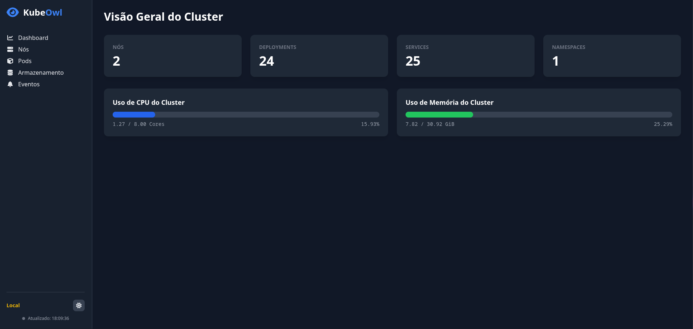

# 🦉 KubeOwl - Dashboard de Monitoramento Kubernetes

**KubeOwl** é um dashboard web simples, leve e fácil de usar para monitoramento de clusters Kubernetes. Com ele, você pode visualizar em tempo real o estado dos nós, pods, armazenamento, eventos e outros recursos do cluster, tudo em uma interface limpa e intuitiva.



---

## ✨ Funcionalidades

- **Dashboard em Tempo Real:** Visão geral dos nós, deployments, serviços e namespaces.
- **Capacidade do Cluster:** Acompanhamento do uso global de CPU e memória com barras de progresso.
- **Detalhes dos Nós:** Lista de nós com seus respectivos consumos de CPU e memória.
- **Visualização de Pods:** Lista de pods em execução com consumo de CPU e memória, ordenável por colunas.
- **Armazenamento:** Acompanhamento dos PersistentVolumeClaims (PVCs) e seus status.
- **Feed de Eventos:** Visualização dos eventos mais recentes do cluster para diagnóstico rápido.
- **Tema Claro e Escuro:** Alternância entre temas conforme sua preferência.

---

## 🚀 Como Executar

O projeto pode ser executado via **Docker**, garantindo um ambiente consistente, ou diretamente na sua máquina para desenvolvimento.

### 🧰 Pré-requisitos

- [Docker](https://www.docker.com/): Para executar a aplicação em container.
- [Go](https://go.dev/) (versão 1.24 ou superior): Apenas necessário para desenvolvimento local (`make run-dev`).
- Acesso a um cluster Kubernetes: O arquivo de configuração `~/.kube/config` deve estar configurado corretamente.

---

## 🛠️ Usando o Makefile

Um `Makefile` foi incluído para facilitar as tarefas mais comuns.

### 🔨 Construir a imagem Docker

```bash
make build
````

### 🚢 Executar a aplicação em container Docker

```bash
make run
```

O dashboard estará disponível em: [http://localhost:8080](http://localhost:8080)

### 🧪 Executar os testes

```bash
make test
```

### 💻 Executar em modo desenvolvimento (local)

```bash
make run-dev
```

### 🔧 Comandos disponíveis

| Comando        | Descrição                                                 |
| -------------- | --------------------------------------------------------- |
| `make build`   | Constrói a imagem Docker.                                 |
| `make run`     | Executa a aplicação via Docker.                           |
| `make test`    | Executa a suíte de testes.                                |
| `make run-dev` | Executa a aplicação localmente (modo desenvolvimento).    |
| `make clean`   | Remove o container Docker `kubeowl`, caso esteja rodando. |
| `make help`    | Lista todos os comandos disponíveis no Makefile.          |

---

## 🤝 Contribuindo

Contribuições são muito bem-vindas! Sinta-se livre para abrir uma issue com sugestões, reportar bugs ou enviar um pull request com melhorias.

---

## 📜 Licença

Este projeto está licenciado sob a [Licença MIT](LICENSE).

---

## ⭐️ Agradecimentos

Se você gostou deste projeto, deixe uma estrela ⭐ no repositório para apoiar o desenvolvimento!